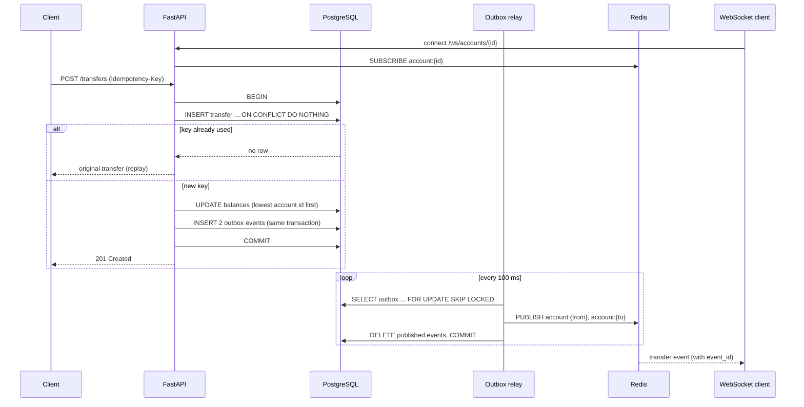

# ledger-service

[](https://github.com/amanuel1271/ledger-service/actions/workflows/ci.yml)


A small payments ledger API. Accounts hold balances; deposits, withdrawals and transfers move money; every change is recorded in a ledger you can page through; and clients can watch an account live over a WebSocket.

It is built to get five things right under concurrency and failure:

- **No double charges.** Every transfer needs an `Idempotency-Key`. Retrying with the same key returns the original transfer instead of moving money again.
- **No overdrafts.** A balance can never go below zero, even with hundreds of transfers hitting the same account at once.
- **No deadlocks.** Two transfers going in opposite directions (A→B and B→A) can't lock each other up.
- **The books always balance.** Every balance change writes a ledger entry in the same transaction, so an account's balance always equals the sum of its entries. A test checks this after hundreds of concurrent operations.
- **No lost events.** Every committed transfer's live event is delivered, even if Redis is down or the process crashes right after the commit (transactional outbox).

## How it works



The database does the safety work, not application code:

| Rule | Enforced by |
|---|---|
| One transfer per idempotency key | `UNIQUE (idempotency_key)`. A concurrent duplicate waits on the index, then replays. |
| Balance never negative | `CHECK (balance >= 0)`. An overdraft rolls back the whole transfer. |
| No deadlocks | Both balance updates run in account-id order. |
| Amounts are exact | Integer cents (`BIGINT`), never floats. |
| Balance = sum of ledger entries | Every change (opening, deposit, withdrawal, transfer in/out) inserts an `entries` row in the same transaction as the balance update. |
| A committed transfer always gets its events | Events go into an `outbox` table in the **same transaction** as the transfer. A rolled-back transfer leaves no events. |
| Events survive a Redis outage | The relay deletes events only after publishing them. If publishing fails, the transaction rolls back and the events are retried. |

## API

| Method | Path | Description |
|---|---|---|
| `POST` | `/accounts` | Create an account: `{"owner": "alice", "opening_balance": 10000}` |
| `GET` | `/accounts/{id}` | Get an account and its balance |
| `POST` | `/transfers` | Move money: `{"from_id": 1, "to_id": 2, "amount": 2500}` with header `Idempotency-Key` |
| `POST` | `/accounts/{id}/deposits` | Add money: `{"amount": 5000}` with header `Idempotency-Key` |
| `POST` | `/accounts/{id}/withdrawals` | Take money out: `{"amount": 1000}` with header `Idempotency-Key`. Fails with `422` rather than overdraw. |
| `GET` | `/accounts/{id}/transactions?limit=50&cursor=` | Ledger history, newest first. Pass `next_cursor` back to get the next page. |
| `WS` | `/ws/accounts/{id}` | Stream transfer events for an account |

| Status | Meaning |
|---|---|
| `201` | Transfer created, or replayed for a key that was already used |
| `404` | Account not found |
| `409` | Idempotency key reused with a different request body |
| `422` | Insufficient funds, invalid amount, or same source and destination |

Interactive docs are at `http://localhost:8000/docs` once it's running.

## Run it

```bash
docker compose up --build
```

```bash
curl -X POST localhost:8000/accounts -H 'Content-Type: application/json' -d '{"owner":"alice","opening_balance":10000}'
curl -X POST localhost:8000/accounts -H 'Content-Type: application/json' -d '{"owner":"bob"}'
curl -X POST localhost:8000/transfers -H 'Content-Type: application/json' \
     -H 'Idempotency-Key: order-42' -d '{"from_id":1,"to_id":2,"amount":2500}'
```

## Tests

The tests run against real PostgreSQL and Redis, the same way CI does:

```bash
docker compose up -d postgres redis
docker compose run --rm api pytest -q
```

They cover a normal transfer, idempotent retries, a reused key with a different body, overdraft rejection, 200 concurrent transfers in both directions (money conserved, no deadlock), live WebSocket events, events surviving a Redis outage (the relay recovers on its own), a rejected transfer leaving no events, deposits and withdrawals (idempotent, overdraft-proof), balance always equal to the ledger after concurrent operations, and history pages covering every entry exactly once.

## Trade-offs

- Events are delivered **at least once**. If the relay crashes after publishing but before deleting, a few events can be sent again. Each event has an `event_id`, so clients can drop duplicates.
- The relay checks the outbox every 100 ms, so live events can lag a transfer by up to about 0.1 s. Postgres `LISTEN/NOTIFY` would cut that if it ever matters.
- With several app instances, each runs a relay. `SKIP LOCKED` stops them from sending the same event twice, but events for one account can then arrive out of order. Order by `event_id` if that matters.
- History uses **keyset (cursor) pagination** (`WHERE id < cursor ORDER BY id DESC`) instead of `OFFSET`. Pages stay stable while new entries arrive, and deep pages are as fast as the first.
- Idempotency keys are unique per operation type: transfers and deposits/withdrawals keep their keys in separate tables.
