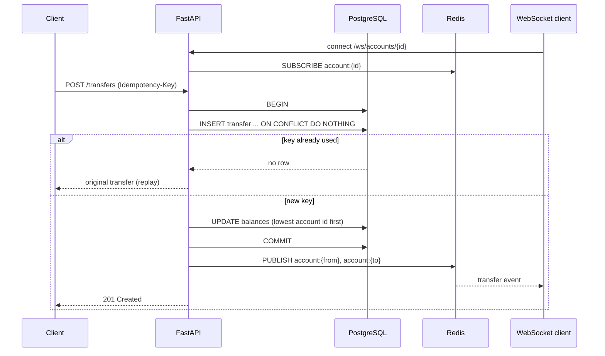

# ledger-service

[](https://github.com/amanuel1271/ledger-service/actions/workflows/ci.yml)


A small payments ledger API. Accounts hold balances, transfers move money between them, and clients can watch an account's transfers live over a WebSocket.

It is built to get three things right under concurrency:

- **No double charges.** Every transfer needs an `Idempotency-Key`. Retrying with the same key returns the original transfer instead of moving money again.
- **No overdrafts.** A balance can never go below zero, even with hundreds of transfers hitting the same account at once.
- **No deadlocks.** Two transfers going in opposite directions (A→B and B→A) can't lock each other up.

## How it works



The database does the safety work, not application code:

| Rule | Enforced by |
|---|---|
| One transfer per idempotency key | `UNIQUE (idempotency_key)`. A concurrent duplicate waits on the index, then replays. |
| Balance never negative | `CHECK (balance >= 0)`. An overdraft rolls back the whole transfer. |
| No deadlocks | Both balance updates run in account-id order. |
| Amounts are exact | Integer cents (`BIGINT`), never floats. |

## API

| Method | Path | Description |
|---|---|---|
| `POST` | `/accounts` | Create an account: `{"owner": "alice", "opening_balance": 10000}` |
| `GET` | `/accounts/{id}` | Get an account and its balance |
| `POST` | `/transfers` | Move money: `{"from_id": 1, "to_id": 2, "amount": 2500}` with header `Idempotency-Key` |
| `WS` | `/ws/accounts/{id}` | Stream transfer events for an account |

| Status | Meaning |
|---|---|
| `201` | Transfer created, or replayed for a key that was already used |
| `404` | Account not found |
| `409` | Idempotency key reused with a different request body |
| `422` | Insufficient funds, invalid amount, or same source and destination |

Interactive docs are at `http://localhost:8000/docs` once it's running.

## Run it

```bash
docker compose up --build
```

```bash
curl -X POST localhost:8000/accounts -H 'Content-Type: application/json' -d '{"owner":"alice","opening_balance":10000}'
curl -X POST localhost:8000/accounts -H 'Content-Type: application/json' -d '{"owner":"bob"}'
curl -X POST localhost:8000/transfers -H 'Content-Type: application/json' \
     -H 'Idempotency-Key: order-42' -d '{"from_id":1,"to_id":2,"amount":2500}'
```

## Tests

The tests run against real PostgreSQL and Redis, the same way CI does:

```bash
docker compose up -d postgres redis
docker compose run --rm api pytest -q
```

They cover a normal transfer, idempotent retries, a reused key with a different body, overdraft rejection, 200 concurrent transfers in both directions (money conserved, no deadlock), and live WebSocket events.

## Trade-offs

- Events are published to Redis right after the database commit. If the process crashes in between, the ledger is still correct but that one live event is lost. A transactional outbox would make events durable.
- Opening balances are set when an account is created. There are no separate deposit or withdrawal endpoints.
